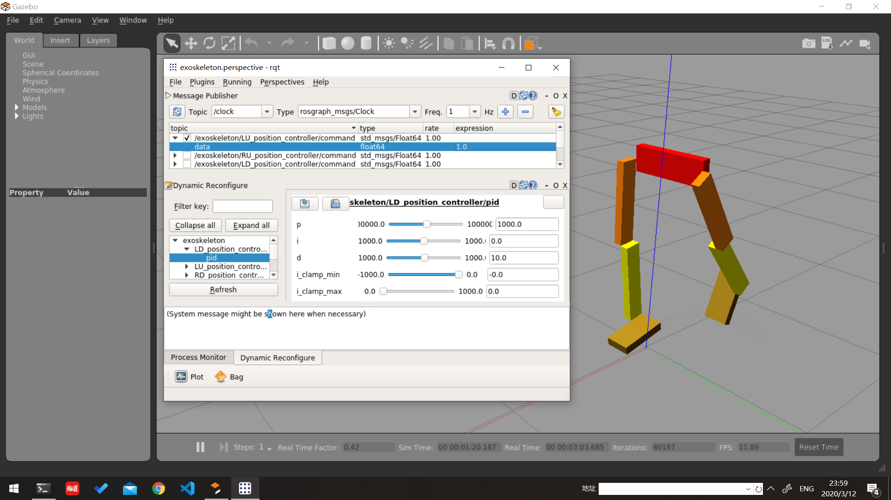

# ROS-Gazebo Simulation  

A simplt ROS-Gazebo simulation 

### Environment Dependence

Both *Ubuntu 16.04 + ros-kinetic* and *Ubuntu 18.04 + ros-melodic* is compatible.

To install ROS:

`sudo apt install ros-<distro>-desktop-full`

We need ROS-Gazebo interface and controller packages:

`sudo apt install ros-<distro>-gazebo-ros-pkgs ros-<distro>-gazebo-ros-control ros-<distro>-ros-controllers` 

**After git clone please change the name of the directory** `mv ROS-Gazebo-Simulation exoskeleton`

### Launch the Simulation

Firstly, copy the directory `exoskeleton` to your `catkin_ws/src`

Launch the exoskeleton model:

`roslaunch exoskeleton world.launch paused:=true`

Launch the `rqt_gui` for control and tuning parameter:

`roslaunch exoskeleton rqt.launch`

upper half for publish joint command.
lower half for reconfigure joint controller PID parameters.
(Default is {p: 100, i: 0.01, d: 10} configured in `config/control.yaml`)

### ROS Topic 

Totally seven links:

`waist_link` `LU_link` `RU_link` `LD_link` `RD_link` `LF_link` `RF_link`

Totally six joints:

 `LU_joint` `RU_joint` `LD_joint` `RD_joint` `LF_joint` `RF_joint`

*L for left, R for right, U for up, D for down, F for foot*
*e.g. LU_link => left up link(left thigh)*

Joint position controller:

```
/exoskeleton/LU_position_controller/command
```

Link IMU plug-in topic:

`/imu/LINKNAME`

### Mechanical Parameter

See in `urdf/robot.xacro`
It's a very simple model.
*It can not keep balance _without_ control.*

### Gazebo Tips  

Since **without** control, the robot model is vety easy to fall down.  
It may be useful to press `space` to pause the simualtion and `ctrl-r` to reset world. 
